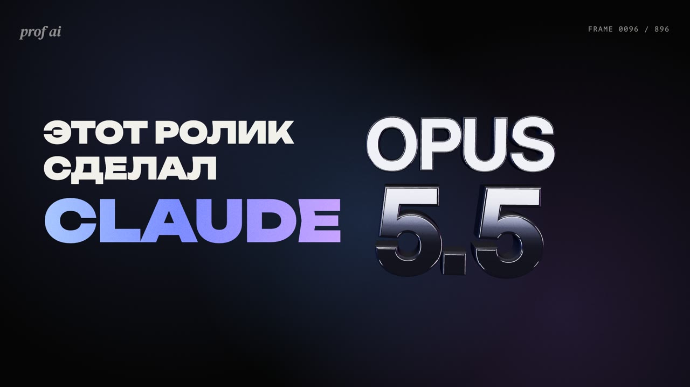

# PROF AI Motion

Скилл для Claude Code, который делает моушн-видео кодом.
Даёшь видео, фото, сайт и музыку — Claude задаёт пару вопросов про стиль и формат, пишет раскадровку, после твоего «ок» верстает кадры на HTML и Three.js, собирает звук и эффекты, подгоняет монтаж под биты трека, проверяет кадры и отдаёт MP4.

Без After Effects и монтажки: кадр — это веб-страница, время — аргумент функции, браузер снимает кадры, ffmpeg склеивает.



## Что умеет
- Reels / Shorts 9:16, YouTube 16:9, квадрат — из одного монтажа
- 3D: хромированный текст, эквалайзер из спектра твоего трека, лента плёнки из твоих видео
- кинетическая типографика, трекинг, шторки, частицы, видео внутри букв
- монтаж под биты любого трека (темп, фаза, вход бита — определяются автоматически)
- звуковые эффекты кодом: удары, «вжухи», щелчки, глитч — не спорят с тональностью трека
- опросник по стилю и палитре: Ethereal Glass, Editorial, Brutal, Soft или свой
- проверка по стоп-кадрам, спектрограмме и громкости до выдачи

## Что нового в 0.2.0
- **Законы моушна в цифрах** (`references/motion-dna.md`) — выжимка из разбора 7 референсов: кривая «мягкие лапы» `(.87,0,.13,1)` с быстрейшей точкой на доле, новый шаг каждого элемента на каждой доле, смаз из 6 подкадров, 3D минимум в каждой третьей сцене.
- **Canvas-движок** (`templates/engine.js`, `templates/reel.html`) — 3D-кольца текста вокруг человека, сборка и взрыв слов, видео внутри букв, порталы, шторки, бумажный 3D-шар, выдавленные буквы, туннель, конфетти.
- **Вырезка людей и объектов локально** на macOS (`scripts/cutout.swift`, встроенный Vision) + честная проверка (`scripts/cutcheck.mjs`).
- **Бит**: `beats.mjs` принимает любой аудиофайл и ищет фазу свёрткой по 1–4 долям; `clicktest.mjs` — A/B-тест щелчками, когда микс слишком плотный и фазу должен выбрать человек.
- **QA**: `sheet.mjs` — сетки кадров (обзор и покадрово), `patch.mjs` — перерисовать только кусок кадров.

## Установка

### 1. Claude Code
Нужна подписка Claude (Pro/Max) или ключ API. Установка — по официальной инструкции: https://docs.claude.com/claude-code
Проверка: в терминале `claude --version`.

### 2. Инструменты (один раз)
- **Node.js 22+** — https://nodejs.org (проверка: `node -v`)
- **ffmpeg** — macOS: `brew install ffmpeg`; Windows: `winget install ffmpeg`; Linux: `sudo apt install ffmpeg` (проверка: `ffmpeg -version`)

Playwright, Three.js и шрифты скилл ставит сам в папку проекта при первом ролике.

### 3. Скилл
Внутри Claude Code:
```
/plugin marketplace add KlingofhustleGH/prof-ai-motion
/plugin install prof-ai-motion@prof-ai-motion
```
Перезапусти Claude Code.

## Как пользоваться
Открой Claude Code в папке, где лежат твои материалы, и напиши:
```
/prof-ai-motion сделай рилс 20 секунд из видео в папке media, музыка track.mp3
```
или просто «сделай моушн-ролик из этих видео под этот трек». Дальше Claude спросит про стиль, палитру и формат, покажет раскадровку и после «ок» соберёт ролик.

Результат: `name.mp4`, обложка `name.jpg` (она же первый кадр) и `share-copy.txt` с текстом для поста.

## Необязательно: сторонние плагины
Скилл работает без них. Если хочешь генерировать новые кадры и музыку нейросетью или работать через HyperFrames — см. [extensions.md](skills/prof-ai-motion/references/extensions.md).
Перед установкой любого чужого скилла прочитай его файлы: в них могут прятать невидимые символы со скрытыми инструкциями.

## Благодарности
- [brag](https://github.com/latent-spaces/brag) (MIT) — идея процесса «изучи → сценарий → сборка → проверка стоп-кадров».
- [Three.js](https://threejs.org) (MIT) — 3D.
- Принципы движения — по мотивам открытых материалов о дизайне интерфейсов, в частности [animations.dev](https://animations.dev) Эмиля Ковальски. Текст скилла написан нами.

## Лицензия
MIT — см. [LICENSE](LICENSE).

---
Сделано в [PROF AI](https://prof-ai.pro) — клуб AI-креаторов.
